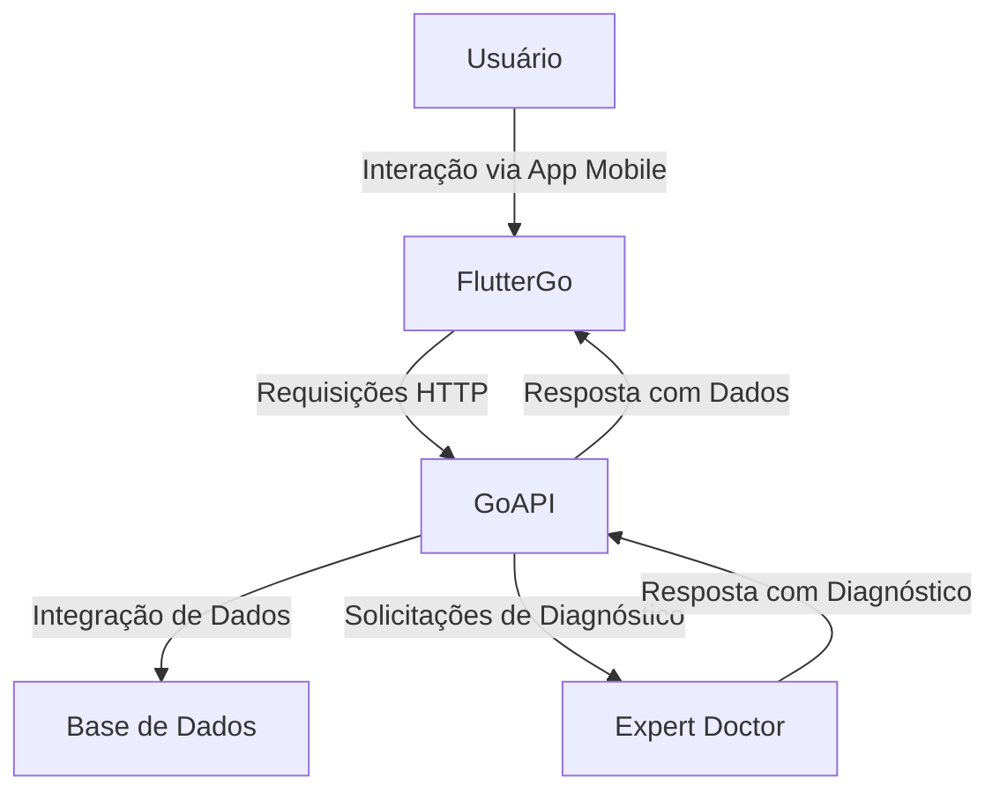

# Go Health Now - Projeto de TCC

**Go Health Now** é um projeto interdisciplinar desenvolvido como Trabalho de Conclusão de Curso (TCC) com o objetivo de integrar tecnologia de ponta e ciência da saúde para melhorar a acessibilidade e eficiência nos cuidados médicos.

O projeto é composto por três principais módulos:

- **FlutterGo**: Aplicativo móvel desenvolvido em Flutter para interação com usuários.
- **GoAPI**: Backend que gerencia dados e integrações.
- **Expert Doctor**: API de diagnósticos baseada em Inteligência Artificial.

---

## 🌟 Visão Geral do Projeto

O **Go Health Now** é uma plataforma que conecta usuários a informações médicas confiáveis e ferramentas de diagnóstico assistidas por IA. O objetivo principal é proporcionar uma solução escalável e acessível para melhorar a experiência de pacientes e profissionais da saúde.

---

## 🏗️ Estrutura Geral do Projeto

Abaixo está um diagrama ilustrando a arquitetura geral do projeto:

1. **FlutterGo**: 
   - Aplicativo mobile para acesso às funcionalidades do Go Health Now.
   - Principais recursos:
     - Splash Screen com autenticação e navegação dinâmica.
     - Recuperação de senha e temas customizáveis.
     - Arquitetura MVVM para escalabilidade e organização.

2. **GoAPI**:
   - API backend desenvolvida em TypeScript.
   - Gerencia dados de usuários, farmácias, produtos e diagnósticos.
   - Oferece endpoints documentados via Swagger.

3. **Expert Doctor**:
   - API baseada em FastAPI e modelos avançados de linguagem (Transformers).
   - Funcionalidades:
     - Identificação de sintomas a partir de descrições textuais.
     - Diagnósticos preliminares com scores de confiabilidade.

---

## 🎯 Objetivo Científico

O **Go Health Now** explora a integração entre tecnologia e saúde para:

- Auxiliar no diagnóstico preliminar por meio de inteligência artificial.
- Otimizar processos de consulta e triagem médica.
- Democratizar o acesso a informações médicas confiáveis.

---

## 📊 Tecnologias Utilizadas

- **Flutter & Dart**: Desenvolvimento do aplicativo móvel.
- **TypeScript, Node.js & Express**: Backend robusto para APIs.
- **Python & FastAPI**: Inteligência Artificial aplicada à saúde.
- **Transformers (Hugging Face)**: Modelos de IA para processamento de linguagem natural.
- **ORM Prisma**: Gerenciamento de banco de dados.
- **Docker**: Containerização e implantação.
- **Mermaid.js**: Diagramas para visualização de fluxos.

---

## 📜 Aviso Legal

**O Go Health Now é uma ferramenta de suporte e não substitui diagnósticos médicos profissionais.** Recomendamos sempre consultar um médico para diagnósticos e tratamentos definitivos.

---

## 🧪 Como Contribuir

1. Faça um fork do repositório.
2. Crie uma branch para sua funcionalidade: `git checkout -b minha-feature`.
3. Submeta um Pull Request descrevendo as alterações.

---

## 📬 Contato

- **Autor**: Polabiel
- **E-mail**: bielgabrieloliveira77@gmail.com
